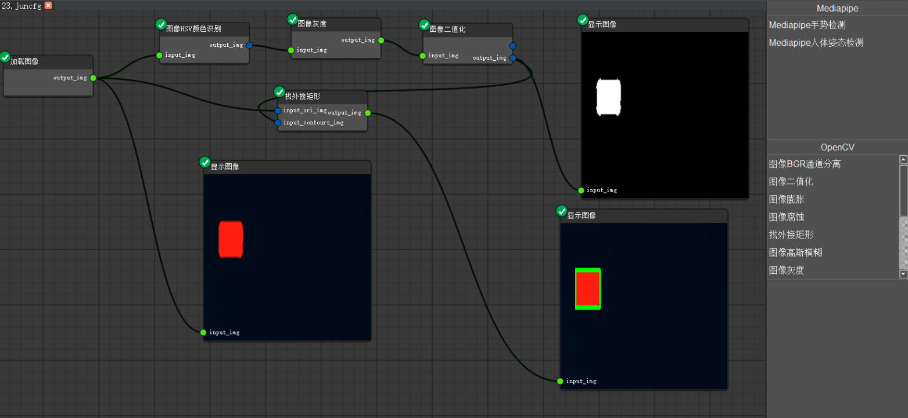
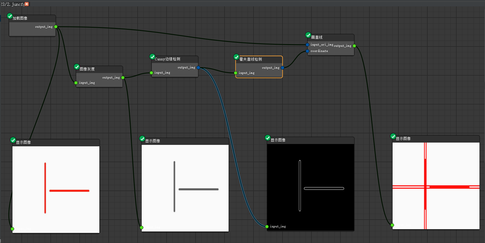
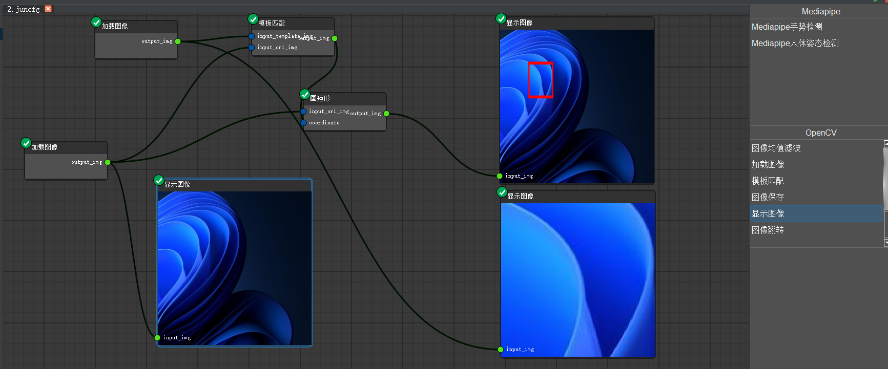

# OpenSV平台
## 框架优调，预计3月20号支持视频输入处理功能。

##### 严正声明：
平台的开源协议为Apache License 2.0，同时也必须遵循第三方库的开源协议。qq交流群为365444132，**有合作需求的可联系本人**。二次开发的问题也可咨询本人。


##### 平台支持的功能
```Plain Text
基于node editor生成的OpenCV节点的编辑器；
基于qtpyeditor的代码编辑功能；
基于qframelesswindow的自定义标题栏；
内置socket功能，（目前没有使用）；
自制的节点runmodule模块，自适应运行节点；
```
##### 升级记录：
**2023.03.14** 

1、支持全局变量传递（类似于写代码，变量不能重复）

2、插件可能没有适配，需要进一步修改。

3、图像可在log框右侧显示。

**2023.03.15** 

1、预计将插件的整合，考虑到全局变量，后期只有一个输入和输出，在整条链上的变量都能获取，为视频实时处理做准备


##### Q&A：
1、项目为个人项目吗？

**本项目为个人想法的项目的，从开始到开源，从设想到雏形，花了大概一年多的时间，如果后期加入的人员多了，我相信会越来越完善。**

2、平台为什么内置socket功能？

【1】当时想开发一款面向高校课堂的编辑器，代码编写完成后可通过socket通信传给教师，进行程序运行与打分。

【2】后期会将runmodule模块单独开放一个exe，提升运行速度，通过socket通信。

3、目前支持视频处理吗？

【1】目前不支持视频，但后期会支持（目前来看很长远，个人精力不足）。

4、远期计划？

【1】目前先适配OpenCV的基本功能，后期加入深度学习，包括但不限于目标检测，目标分割等

5、为什么平台内没有插件的代码？

【1】平台是平台，插件是插件，插件的代码可前往下方github地址拉去代码

[https://github.com/junasir/OpenSV\_Plugins](https://github.com/junasir/OpenSV_Plugins)

支持的插件有：**1.图像读取2.图像灰度3.图像二值化4.图像显示5.图像保存6.图像BGR通道分离7.图像HSV通道分离8.图像高斯模糊9.图像翻转10.图像腐蚀11.图像膨胀12.图像HSV颜色识别13.图像找外接矩形14.图像画直线15.图像画矩形16.canny边缘检测17.模板匹配18.hough直线检测19.仿射变换20.print函数21.图像均值滤波22.mediapipe姿态估计23.mediapipe手势估计24.图像方框滤波25.图像中值滤波25.图像laplacian算子**

【2】需要注意要将文件夹名称改成JuPlginPack


6、目前能达到什么样的效果？






##### 赞助


##### 开源协议：
本项目基于 [Apache 2.0 license](https://github.com/junasir/OpenSV/blob/main/LICENSE)